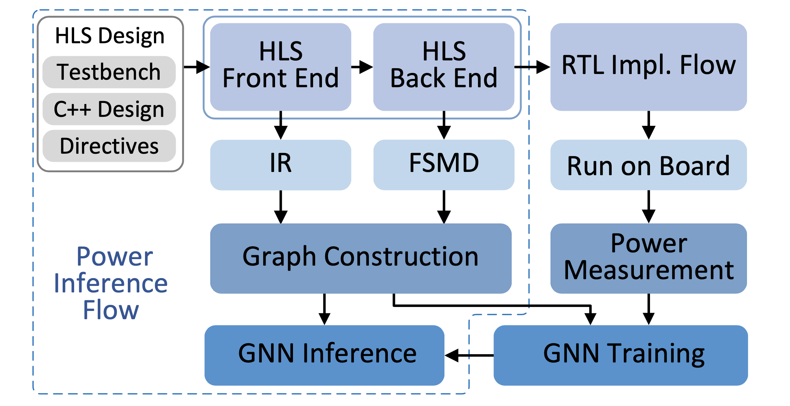

# PowerGear: Early-Stage Power Estimation in FPGA HLS via Heterogeneous Edge-Centric GNNs
We propose PowerGear, a graph-learning-assisted power estimation approach for FPGA HLS, which features high accuracy, efficiency and transferability. PowerGear comprises two main components: 
- a graph construction flow
- a customized graph neural network (GNN) model

Compared with on-board measurement, PowerGear estimates total and dynamic power for new HLS designs with errors of 3.60% and 8.81%, respectively, which outperforms the prior arts in research and the commercial product Vivado. In addition, PowerGear demonstrates a speedup of 4× over Vivado power estimator. Finally, we present a case study in which PowerGear is exploited to facilitate design space exploration for FPGA HLS, leading to a performance gain of up to 11.2%, compared with methods using state-of-the-art predictive models.

More details could be found in our DATE 2022 paper. If PowerGear is helpful to your works, please cite:

```
@inproceedings{lin2022powergear,
  title={PowerGear: Early-Stage Power Estimation in FPGA HLS via Heterogeneous Edge-Centric GNNs},
  author={Lin, Zhe and Yuan, Zike and Zhao, Jieru and Zhang, Wei and Wang, Hui and Tian, Yonghong},
  booktitle={Procs. of Design, Automation and Test in Europe Conference and Exhibition (DATE)},
  year={2022}
}
```

## PowerGear Overview

 <p align="center">
  
</p>

In the training stage, graph- structured samples are constructed using HLS results, ground truth power values are collected from real measurement on board after RTL implementation, and a transferable GNN model is trained; in the inference stage, graph samples for new designs are generated after HLS runs and the trained GNN model is seamlessly employed for power prediction.

## How to Construct Graphs from HLS

Please look at the `Readme.md` file of each subfolder inside the `graph_construction` folder.
All the program infromation can be found.

## How to Train, Test and Evaluate Our Models
Please look at the `Readme.md` file of each subfolder inside `HEC_GNN` folder.
All the program infromation and pretrained models can be found.


## File Architecture
    .
    ├── dataset                         # Paper dataset
    │   ├── benchmark                   # Benchmark application
    │   └── graph_sample                # Graph sample dataset used in HEC_GNN                             
    ├── hec_gnn                         # The HEC_GNN model
    │   ├── cov                         # Graph convolution layer
    │   ├── ensemble_model              # Ensemble model
    │   ├── single_model                # Single model
    │   ├── HEC_GNN_env_install.sh      # The environment installation script
    │   └── README.md                   
    ├── graph_construction              # The graph construction
    │   ├── README.md                 
    │   ├── feature_extraction          # Feature extraction flow
    │   └── sample_generation           # Sample generation flow
    ├── paper_model                     # Trained model in our paper
    │   ├── test_result                 # The test results for each dataset in our paper.
    │   └── trained_model               # The trained model for each dataset in our paper.
    ├── pic                             
    ├── utils                           # Some basic functions
    └── DATE_22_PowerGear.pdf           # Paper


## License
MIT License

## Contact
For more information please contact Zhe Lin, Zike Yuan.

Zhe Lin : `zlinaf@connect.ust.hk`

Zike Yuan: `zyua138@aucklanduni.ac.nz`
  

