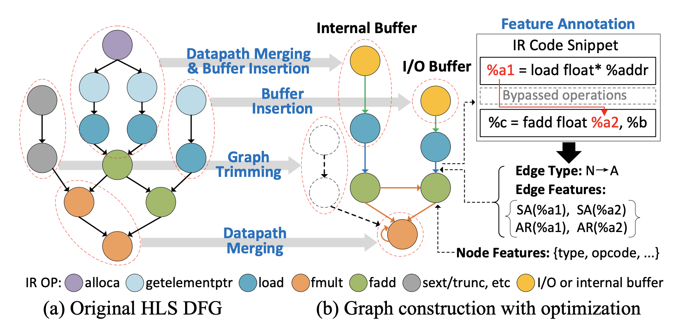

# Graph Construction
 

  

This is the graph construction flow described in the paper. There are two main components in this program:
- feature_extraction: profile the hardware designs and create necessary graph features
- sample_generation: generate the PyTorch-compatible graph samples for model training and testing

## How to use:
- First run the feature construction flow and then the sample generation flow.
- Before execution, make sure the HLS designs are properly generated and compressed (check how to do it in the `/dataset/benchmark` folder).

## Required toolkits and versions:
   - LLVM: 11.0.0
   - scikit-learn: 0.24.1
   - Python: 3.8.8
   - PyTorch: 1.7.0
   - PyTorch Geometric: 1.6.3