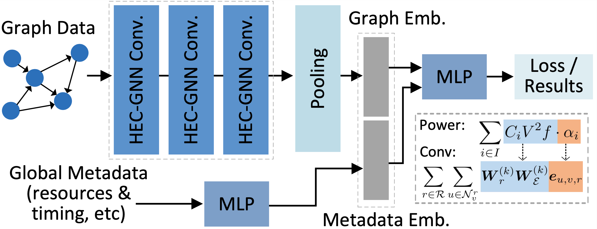

# [Heterogeneous Edge-Centric GNNs (HEC-GNNs)](https://arxiv.org/abs/2201.10114)
We propose a novel power-aware heterogeneous edge-centric GNN model which effectively learns heterogeneous edge semantics and structural properties of the constructed graphs via edge-centric neighborhood aggregation, and fits the formulation of dynamic power.

## Overview
We propose a novel heterogeneous edge-centric GNN model for power modeling, which is named HEC-GNN. Different from general purpose GNNs that primarily work on node features, HEC-GNN is enhanced with the capability to exploit informative heterogeneous edge semantics and structural properties via the novel edge-centric aggregation scheme, and is aware of power via adaptively approximating the formation of dynamic power.
 

  

## How to Train, Test and Evaluate Our Models
* If you want to use single HEC_GNN model, please look the details in `Readme.md` of  `single_model` folder.
* If you want to use ensemble model of HEC_GNN, please look the details in `Readme.md` of  `ensemble_model` folder.

## Code Architecture
    .
    ├── conv                            # Graph convolution layer code
    ├── ensemble_model                  # Code for Ensemble model
    │   ├── get_ensemble_result         # Get ensemble result
    │   ├── test                        # Get test result
    │   ├── train                       # Train model
    │   └── README.md                   
    ├── baseline_model                  # Baseline model of GNN
    │   ├── README.md                   
    │   └── main.py                     # Code of training
    ├── single_model                    # Code for Single_HEC_GNN model
    │   ├── README.md                   
    │   └── example                     
  

## Requirements

 - [PyTorch 1.7.0](https://pytorch.org/get-started/locally/) 
 - [torch-geometric 1.6.3](https://pytorch-geometric.readthedocs.io/en/latest/index.html)
 - torch-scatter 2.0.6
 - torch-sparse 0.6.9

Install enviroment by runing:

    source HEC_GNN_env_install.sh
    

